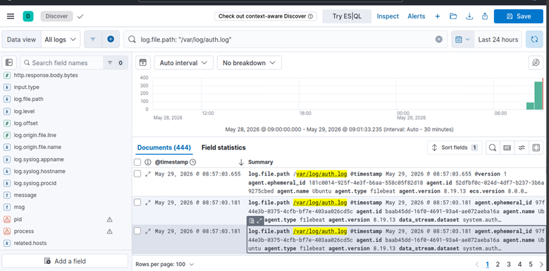
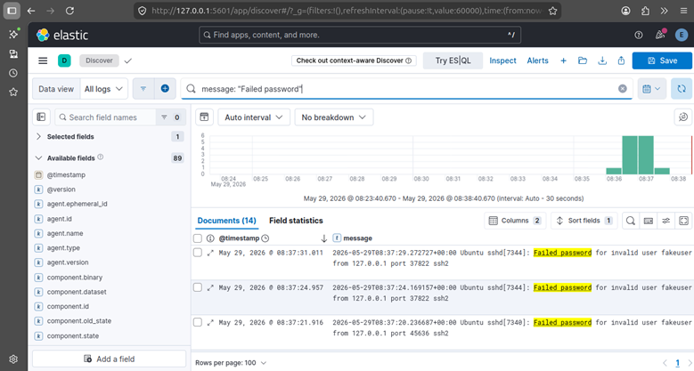
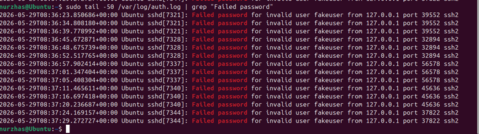
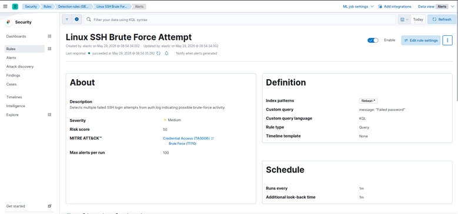
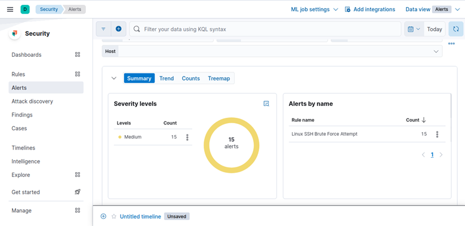
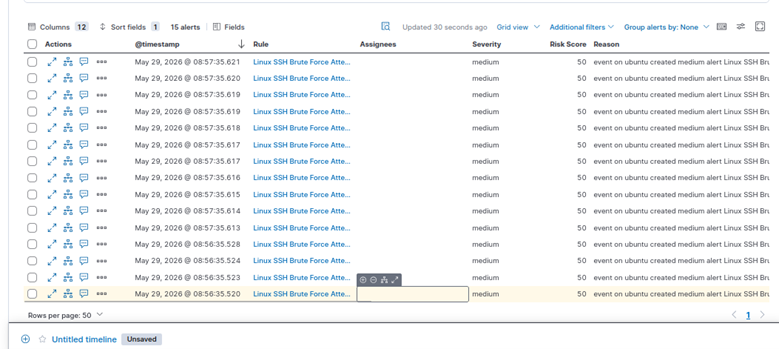
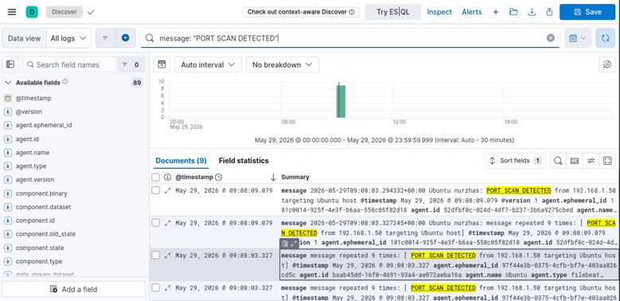
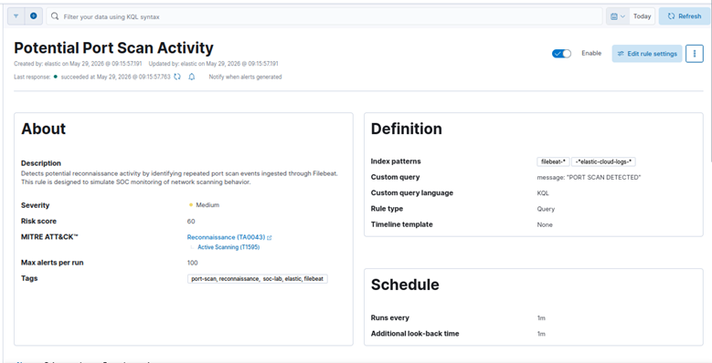
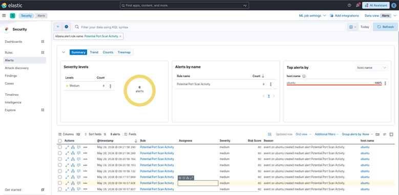

# Home SOC Lab: SIEM Alert Triage with Elastic Stack

## Project Summary

This project demonstrates the deployment and operation of a Security Information and Event Management (SIEM) environment using the Elastic Stack (Elasticsearch, Kibana, and Filebeat) on Ubuntu Linux.

The objective was to simulate Security Operations Center (SOC) workflows by collecting Linux authentication logs, creating custom detection rules, generating security alerts, and performing alert triage and investigation.

During this project, I configured Filebeat to collect system logs, created detection rules for SSH brute-force attacks and port scanning activity, and investigated generated alerts through Kibana.

---

## Project Objectives

* Deploy Elasticsearch, Kibana, and Filebeat on Ubuntu
* Collect and analyze Linux authentication logs
* Create custom detection rules
* Generate and investigate security alerts
* Perform SOC-style alert triage
* Apply MITRE ATT&CK techniques to detections
* Document security findings

---

# Lab Architecture

```text
Ubuntu Linux
     │
     ▼
 Filebeat
     │
     ▼
Elasticsearch
     │
     ▼
  Kibana
     │
     ▼
Detection Rules
     │
     ▼
Security Alerts
```

---

# Technologies Used

| Technology      | Purpose                   |
| --------------- | ------------------------- |
| Ubuntu Linux    | Operating System          |
| Elasticsearch   | Log Storage & Search      |
| Kibana          | Visualization & Alerting  |
| Filebeat        | Log Collection            |
| SSH             | Authentication Monitoring |
| Syslog/Auth.log | Security Event Source     |
| MITRE ATT&CK    | Detection Mapping         |

---

# Detection Use Cases

## 1. SSH Brute Force Detection

### Scenario

An attacker attempts multiple failed SSH logins against a Linux host.

### Detection Query

```kql
message: "Failed password"
```

### Severity

Medium

### MITRE ATT&CK

**T1110 - Brute Force**

### Investigation Steps

1. Review authentication failures.
2. Identify targeted accounts.
3. Determine attack frequency.
4. Check for successful logins following failures.
5. Escalate if compromise indicators exist.

---

## 2. Port Scan Detection

### Scenario

Reconnaissance activity is detected against a Linux host.

### Detection Query

```kql
message: "PORT SCAN DETECTED"
```

### Severity

Medium

### MITRE ATT&CK

**T1595 - Active Scanning**

### Investigation Steps

1. Review source activity.
2. Identify targeted assets.
3. Determine scan frequency.
4. Investigate related alerts.
5. Assess potential follow-on attacks.

---

# Project Evidence

## Log Ingestion Verification

Filebeat successfully collected and forwarded Linux authentication logs into Elasticsearch.



---

## Failed SSH Authentication Events

Kibana Discover showing failed SSH login attempts used for brute-force detection.



---

## Authentication Evidence from Linux Host

Verification of failed password events directly from the Ubuntu host.



---

## SSH Brute Force Detection Rule

Custom Kibana detection rule created to identify repeated failed SSH login attempts.



---

## SSH Alert Dashboard

Generated alerts resulting from simulated brute-force activity.



---

## SSH Alert Investigation View

Alert details and triage view used during investigation.



---

## Port Scan Log Events

Simulated reconnaissance activity successfully ingested into Elasticsearch.



---

## Port Scan Detection Rule

Custom rule used to detect port scanning behavior.



---

## Port Scan Alert Dashboard

Generated alerts resulting from simulated port scan activity.



---

# SOC Analyst Skills Demonstrated

This project demonstrates hands-on experience with:

* SIEM Administration
* Log Analysis
* Detection Engineering
* Alert Triage
* Incident Investigation
* Linux Security Monitoring
* Security Operations
* MITRE ATT&CK Mapping
* Incident Documentation
* Threat Detection

---

# Lessons Learned

Throughout this project I gained practical experience in:

* Deploying and configuring the Elastic Stack
* Collecting Linux security logs with Filebeat
* Creating detection rules in Kibana
* Generating and validating security alerts
* Investigating suspicious activity
* Mapping detections to MITRE ATT&CK
* Documenting security investigations

---

# Future Improvements

Planned enhancements include:

* Windows Event Log Monitoring
* Auditbeat Integration
* Suricata IDS Integration
* Threat Intelligence Feeds
* Custom Kibana Dashboards
* Automated Alert Notifications
* Detection Tuning and Optimization

---

# Repository Structure

```text
home-soc-lab-elastic/
│
├── README.md
│
├── screenshots/
│   ├── 01_log_ingestion.png
│   ├── 02_failed_ssh_logins.png
│   ├── 02_failed_ssh_logins_interminal.png
│   ├── 03_ssh_rule.png
│   ├── 04_ssh_alert.png
│   ├── 04_ssh_alert_list.png
│   ├── 05_portscan_logs.png
│   ├── 06_portscan_rule.png
│   └── 07_portscan_alert.png
│
├── reports/
├── runbooks/
└── detection-rules/
```

---

# Author

**Nurzhas Bolatbekov**

Aspiring SOC Analyst focused on Security Monitoring, Detection Engineering, Incident Response, and Blue Team Operations.

This project was created to develop practical SOC skills through hands-on SIEM deployment, alert creation, and security event investigation.

